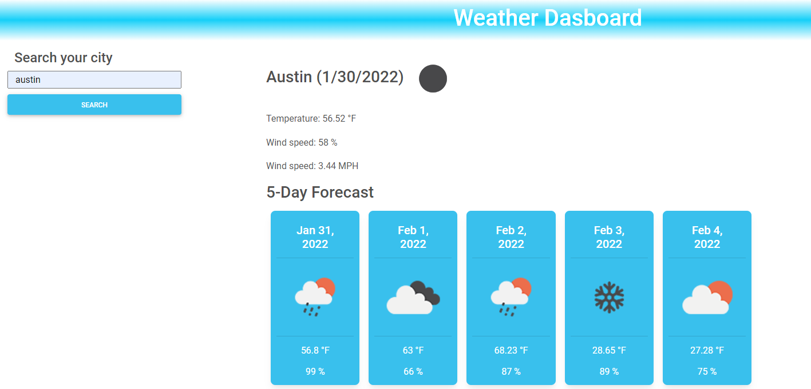

# new-weather-dashboard

Javascript Challenge

**Version 1.5.0**

**Weather Dashboard App challenge activity.**

The aim of this project is to create a simple weather dashborad application that allows a user to search for a city's weather forecast and save those searched cities.

This project focuses on the use of javascript to create this application.

## Acceptance criteria

- Given a weather dashboard with form inputs, when I search for a city, then I am presented with current and future conditions for that city and that city is added to the search history.
- When I view current weather conditions for that city, then I am presented with the city name, the date, an icon representation of weather conditions, the temperature, the humidity, the wind speed, and the UV index.
- When I view the UV index, then I am presented with a color that indicates whether the conditions are favorable, moderate, or severe.
- When I view future weather conditions for that city, then I am presented with a 5-day forecast that displays the date, an icon representation of weather conditions, the temperature, the wind speed, and the humidity.
- When I click on a city in the search history, then I am again presented with current and future conditions for that city.

## Built With

- HTML
- CSS
- Javascript
- Bootstraps
- Material design bootstrap
- Moment.js
- Open Weather API

## Work Completed

**A successful completion of this project includes the following:**

- [x]Use of loops and if, else, esleif, and while statements.
- [x]Application of arrays
- [x]Use of DOM
- [x]Creating multiple variables and functions
- [x]Applying queryselectors to retrieve information
- [x]Applying bootstraps
- [x]Applying local storage to retrieve information

## Project Visual

- [x]Showing the current date at the top of the calender app.

## Github pages and links

This project has been deployed to GitHub Pages. 
- [Deployed application](https://kenesei91.github.io/new-weather-dashboard/)

- [Github Repository](https://github.com/kenesei91/new-weather-dashboard)

## Contributors

- Kenechukwu K Ilochonwu <keneilo91@yahoo.com>

## Licence & Copyright

© Kenechukwu K Ilochonwu, Web Project Design

Licensed under the [LICENSE] (MIT LICENSE)